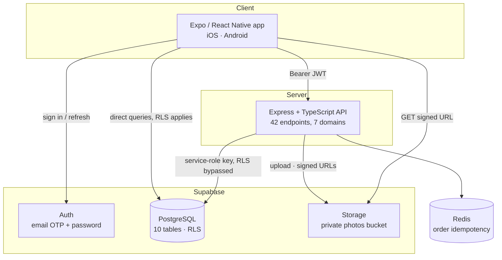
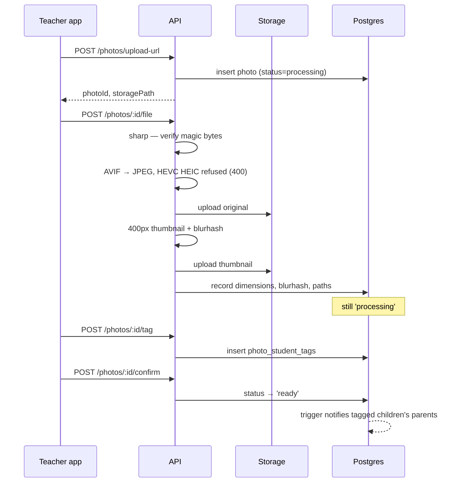
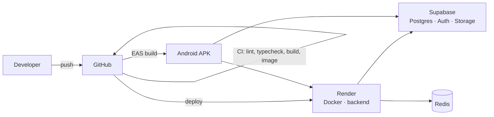

# Hive — Architecture

**Audience:** anyone picking up this codebase, and the project evaluator.
**Status:** current as of 29 August 2026.

---

## 1. What the system does

Preschools photograph classroom activity and want to share those photos with
parents. The constraint that shapes every design decision: **a parent must see
photos of their own child and no one else's.** Not "mostly", not "by
convention" — structurally.

Three roles:

| Role | Does |
|---|---|
| **Teacher** | Uploads photos to a class, tags which children appear in each |
| **Parent** | Sees a feed of photos their child is tagged in; reads a per-child diary of the whole year; orders prints |
| **Admin** | Manages schools, classes, students, teachers, parent↔child links |

---

## 2. System overview



---

## 3. The two data paths

This is the most important architectural fact in the project, and the one most
likely to trip up a new contributor.

**Path A — through the API.** The app calls Express with the user's Supabase
JWT. The API verifies it, loads the user's role and school, then queries
Postgres using the **service-role key**. That key is exempt from row level
security by design.

**Path B — direct to Supabase.** A few hooks query Postgres directly with the
user's own JWT, so **RLS applies**. Currently: `useChildren`, `useClasses`,
`teacherService.getClassStudents`, `authStore.initialize`.

### Why both exist

Path B suits simple reads of rows the user owns — a parent's own children, a
teacher's own classes. RLS expresses that cleanly and saves a network hop.

Path A is required wherever the server must be trusted: order pricing (a client
must not influence what it is charged), multi-table authorization, image
processing, idempotency, and issuing signed URLs.

### The consequence

**RLS does not protect the API.** The 545-line policy set in migration `00011`
is real and correct, but it guards Path B only. Every API endpoint must
re-implement authorization explicitly in its service function.

The Week 14 audit found four endpoints that did not, which is exactly the
failure mode this split invites. The correct framing is defence in depth:

| Layer | Purpose | Trusted? |
|---|---|---|
| Client route guards | UX — don't show a screen the user can't use | **No** |
| API `roleGuard` + ownership checks | The real control | **Yes** |
| Row level security | Last line; protects Path B | **Yes** |

---

## 4. The privacy model

A parent reaches a photo only through this chain:

```
profiles (parent)
   └─ parent_student_mappings
        └─ students
             └─ photo_student_tags
                  └─ photos
```

**There is no direct relationship between a parent and a photo.** That makes
the guarantee a property of the schema rather than something an application
query can accidentally bypass. A missing `WHERE` clause returns nothing, not
everything.

`photo_student_tags` is the pivot. A photo with no tags is invisible to every
parent — which is why upload ordering matters (§6).

---

## 5. Request lifecycle

```
requestId → helmet → CORS → body limit → rate limit → request log
   → authenticate (verify JWT, load role + school)
   → roleGuard (reject wrong role)
   → validate (Zod at the route boundary)
   → controller (HTTP concerns only)
   → service (business logic + ownership checks)
   → Supabase
   → response envelope
```

Responses are uniform:

| Shape | Used for |
|---|---|
| `{ success: true, data }` | Single resource |
| `{ success: true, data, cursor }` | Paginated list |
| `{ success: false, message, code }` | Any error |

Errors are thrown as `AppError` and formatted centrally. Controllers do not
hand-roll error responses.

---

## 6. The photo pipeline



### Where HEIC is actually handled

Not on the server. `sharp`'s prebuilt libvips ships libheif with an AV1 codec
and no HEVC codec, and an iPhone HEIC is HEVC-coded. The container parses — so
`metadata()` reports `format: 'heif'` — and only the pixel decode fails, which
is why review never caught it. Verified against a real HEVC HEIC on 24 July
2026: *"No decoding plugin installed for this compression format"*.

The transcode happens **on the device**. `(teacher)/upload.tsx` asks the iOS
picker for a compatible representation, so the phone converts to JPEG and no
HEIC leaves it. The server's conversion branch still runs — it handles AVIF,
which shares the HEIF container — and an HEVC HEIC that reaches it anyway is
refused with 400 and a message the teacher can act on, rather than raw libvips
text. Converting server-side would need libvips built against libheif with
`libde265`, which is a Dockerfile change, not an application-code one.

### Why confirm is a separate step

`notify_parents_on_photo` fires on the transition to `ready` and loops over
`photo_student_tags`. If the photo becomes ready before tagging, the loop runs
against zero rows and **no parent is ever notified**.

The original pipeline did exactly that. Teachers still received their own
upload-complete notification, so the gap was invisible until someone asked why
parents saw nothing.

A failure at confirm leaves the photo in `processing` — invisible but
recoverable by retry. That is strictly better than a `ready` photo with no tags,
which is invisible to parents *and* silent.

### Why processing is synchronous

Image processing was originally a BullMQ queue. It was never enqueued — a
repo-wide search for `.add(` found only `Set.add` — so thumbnails, blurhash and
dimensions were permanently null and the feed served full-resolution originals,
up to 25 MB each, to a mobile grid.

The workers could not have worked in any case: they read from S3 while files
were written to local disk, and updated a `content_type` column that does not
exist.

`sharp` takes 100–300 ms for a phone photo — imperceptible next to the upload
itself. **The queue was removed rather than repaired.** That drops a Redis
dependency for background work and an entire class of stuck-in-processing
failures. At tens of uploads per day the queue bought nothing and cost an
operational surface.

---

## 7. Photo access control

The bucket is **private**. Reads go through short-lived signed URLs, issued only
after the API has verified the caller.

Previously two independent exposures existed simultaneously: the bucket was
created public with a `TO public` read policy, and the API served the uploads
directory through `express.static` mounted before any authentication. Any
child's photograph was reachable by anyone with the URL, with no credential and
no logging.

| Property | Value |
|---|---|
| Bucket | Private |
| URL lifetime | 1 hour |
| Signing | Batched — one call per feed page, not two per photo |
| Client cache | 5 min query staleness; images cached by `expo-image` |

A one-hour lifetime comfortably exceeds the client's cache window, so a user
never holds a URL that has expired underneath them.

---

## 8. Pagination

All seven list endpoints use **cursor pagination**, not offset. The cursor is
base64url of `{ createdAt, id }`.

Offset pagination shifts when rows are inserted mid-scroll — a parent scrolling
a feed while a teacher uploads would see duplicates or skips. Cursors are stable
under concurrent writes.

The parent feed is a single joined query. It previously fetched *every*
`photo_student_tags` row for a parent's children with no limit, then passed all
resulting photo IDs back as an `IN` filter — for a child with a couple of
thousand tagged photos, a URL containing thousands of UUIDs, which PostgREST
rejects with 414. The feed did not degrade as data grew; it stopped working.

---

## 9. The diary

The feed answers "what arrived today". The diary answers "how has the year
gone", which is a different query and needed different machinery.

**It is scoped to exactly one child**, not to the caller's children. Every read
goes through `assertStudentLinked`, which returns **404 rather than 403** — a
parent asking after a child who is not theirs learns that the child does not
exist as far as their account is concerned, rather than that it exists and is
withheld. Doing it once at the entry point means no query below has to
re-establish the boundary.

That single-student scope also removes work the feed cannot avoid. The feed
filters on a *set* of children, so a photograph of two siblings matches twice
and has to be de-duplicated; the diary filters on one, and
`uq_photo_student_tag` permits at most one tag row per (photograph, student).

**Months are bucketed in the viewer's calendar, not the server's.** The client
sends `tzOffset` and the boundaries are computed from it, so a photograph taken
at 11pm does not slide into the next month for a parent in a different timezone.
The bounds are half-open rather than inclusive, so a photograph taken in the
first millisecond of a month cannot land in two chapters and consecutive months
tile the timeline with no gap and no overlap. `tzOffset` is bounded to
UTC-12:00 through UTC+14:00 so a malformed value cannot shift a boundary
somewhere absurd, and it defaults to 0 rather than rejecting a caller that omits
it. The arithmetic lives in `utils/diaryCalendar.ts` because it is pure, and
being pure it is tested without a database.

**Where the scan gets cut matters.** The outline scans at most 4,000
photographs, fetched newest-first and then reversed — which is not the same as
fetching ascending. Scanning ascending and stopping at the ceiling would drop
the *newest* photographs, so a child past the ceiling would open their diary and
find it ended a year ago. Cutting from the far end loses the beginning instead,
which is the half a parent has already seen, and `summary.truncated` reports it.
A chapter is capped at 300 photographs and fetches one over the cap, so a full
month is reported as truncated rather than silently ending on a round number.

Each chapter carries one signed cover image, so an outline of a whole year is
one signing call per month rather than one per photograph.

---

## 10. Key decisions

| # | Decision | Rationale |
|---|---|---|
| 1 | **Supabase Storage** over S3 or Cloudinary | Already provisioned, SDK already installed, no new vendor or credentials. Private buckets and signed URLs come free. |
| 2 | **Synchronous `sharp`** over a job queue | ~200 ms cost; removes a dependency and a failure mode. See §6. |
| 3 | **Redis kept, but only for idempotency** | Order creation needs a distributed lock. Nothing else does. |
| 4 | **Cursor over offset pagination** | Stability under concurrent writes. |
| 5 | **Integer minor units** for money — rupees held as paise | Floating-point currency is a classic defect; the original code mixed cents and dollars across three layers. |
| 6 | **Monorepo** with pnpm + Turborepo | Two deployables sharing lint, commit and type conventions. |
| 7 | **Trunk-based development** | A `develop` branch was tried and abandoned — half the team committed to `main` anyway and the two diverged within days. |

---

## 11. Known limitations

Stated plainly rather than omitted:

- **The service-role key bypasses RLS**, so API authorization is only as good as
  the explicit checks in each service. This is mitigated, not eliminated.
- **OTP lockout is client-side only.** The attempt counter lives in component
  state and resets on remount. Real protection is Supabase Auth's rate limits.
- **Signed URLs are bearer tokens.** Anyone holding one can read that photo for
  up to an hour. Acceptable given the lifetime, but it is a real property.
- **No audit log.** Admin actions — role changes, parent mappings, deletions —
  are logged to stdout but not persisted.
- **Photo deduplication was designed but never wired.** `idx_photos_dedup`
  exists; the client never computes the SHA-256 hash.

---

## 12. Deployment topology



**This topology was never provisioned.** It records the intended shape, not
something that exists: deployment was ruled out of scope on 16 August 2026, so
there is no Render service, no EAS build and no APK, and none is planned. The
project is demonstrated locally and on physical hardware over the LAN.

Deliberately simple. No Kubernetes, no service mesh, no infrastructure-as-code —
none of it would be exercised at this scale, and each piece would be something
to explain without a reason for existing.

---

## 13. Scaling assessment

Honest rather than aspirational:

| Concurrent users | Verdict | Binding constraint |
|---|---|---|
| 10 | Fine | — |
| 100 | Expected to hold | Free-tier host before the application |
| 1,000 | Would need work | Auth does two DB round trips per request; no caching layer |
| 10,000 | Not a target | Would need genuine re-architecture |

**100 concurrent users is the demonstrated ceiling** — a local k6 measurement,
not one taken against a deployment. Beyond that the first thing to address is
the double round trip in `authenticate` — one call to verify
the token, one to load the profile — which could be cached in Redis or carried
in JWT claims.
