# Hive - User Manual

Hive is a photo sharing application for preschools, built so that a parent sees
only the photographs their own child appears in. A teacher photographs the day
and tags which children are in each picture; a parent opens the app and finds
those pictures, a diary of their child's year, and a way to order prints. An
administrator sets up the schools, classes and children behind all of it, and
decides which parent is linked to which child.

There are three roles, and the application looks different for each one:

| Role | What they do |
|---|---|
| **Teacher** | Photographs a class, tags the children in each photo, sends them to those children's families |
| **Parent** | Reads their child's diary, browses the moments feed, opens a photo, orders prints, gets an alert per new photo |
| **Administrator** | Manages schools, classes, children and people, links parents to children, and works the print fulfilment queue |

The role is not something you choose. It is stored against your account, and
the server decides what you may see on every single request. The role picker on
the login screen only chooses which sign-in fields appear.

---

## Contents

1. [Getting the application running](#1-getting-the-application-running)
2. [Signing in](#2-signing-in)
3. [For teachers](#3-for-teachers)
4. [For parents](#4-for-parents)
5. [For administrators](#5-for-administrators)
6. [Troubleshooting](#6-troubleshooting)
7. [What the application does not do](#7-what-the-application-does-not-do)

---

## 1. Getting the application running

This manual assumes somebody has already installed and started the project. The
full installation walkthrough is in [`README.md`](../../README.md) and
[`docs/environment-setup.md`](../environment-setup.md), and this section does
not repeat it. In short, two things have to be running before the application
is usable:

1. **The backend API**, on port 4000. Check it with
   `curl -s localhost:4000/health`, which should report `"database": "ok"`.
2. **The application itself**, served by Expo on port 8081.

Hive is a React Native application and targets **iOS and Android**. There are
three ways to open it:

| Surface | How | Notes |
|---|---|---|
| **iPhone or Android phone** | Install Expo Go, then scan the QR code that Expo prints in the terminal | The intended surface. `EXPO_PUBLIC_API_URL` must be the LAN address of the machine running the backend, not `localhost` |
| **Android, installed** | `expo run:android` builds and installs a standalone app | Needed if you want `hive://` deep links to open the app |
| **Browser** | `pnpm --filter @hive/mobile exec expo start --web`, then open `http://localhost:8081` | A convenience for looking at screens quickly. It is not a supported product surface |

**On a phone, `localhost` is the phone.** If `EXPO_PUBLIC_API_URL` is left as
`http://localhost:4000`, the phone will look for the backend on itself, find
nothing, and every screen will fail to load. Set it to the host machine's LAN
address instead, which on macOS you can read with `ipconfig getifaddr en0`.

The demonstration data is created by the seed script. It builds two schools,
four classes, nine children, eight people, photographs with real thumbnails,
notifications and a few orders, so every screen in this manual has something to
show.

---

## 2. Signing in

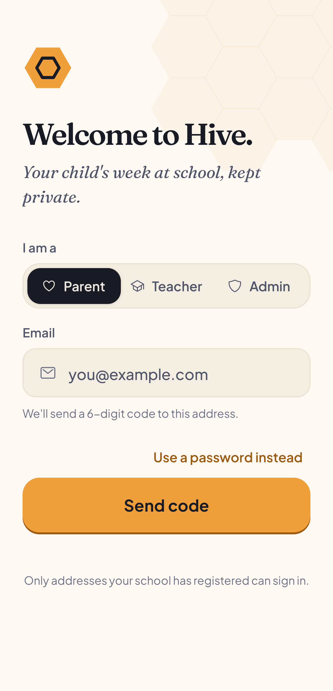

*The login screen. Pick who you are, enter your email, and choose your sign-in
method.*

The screen asks one question first, under **I am a**: Parent, Teacher or Admin.
That choice does not grant you anything. It only decides which fields the screen
shows you. Your real role comes from your account, and if you pick the wrong
card you will still land on the screens your account is entitled to.

**Sign in with a password.** Steps, in order:

1. Tap **Parent**, **Teacher** or **Admin**.
2. Tap **"Use a password instead"**, the link under the main button. Parent and
   Teacher start on the one-time code method, so this step is easy to miss.
   Admin is already on password and does not show the link.
3. Enter the email address of the account.
4. Enter the password and tap **Sign in**.

**Why a password and not the emailed code.** The demonstration accounts use
addresses ending in `.demo`, such as `parent.rajesh@bloom.demo`. That domain
does not exist and cannot receive mail, so a one-time code sent to it never
arrives. Even with a real address, the default mail service is rate limited to a
few messages an hour, which is not something to rely on in front of an examiner.
Password sign-in is the supported path for these accounts.

**Where the credentials live.** The demonstration accounts are created by the
seed script, and their passwords come from your own environment file. The
teacher and parent accounts use the value of **`DEMO_PASSWORD`**; the
administrator account uses **`ADMIN_EMAIL`** and **`ADMIN_PASSWORD`**. Those
values are not written down in the repository, deliberately, and this manual
does not print them either. Read them from your `.env` file.

The accounts worth knowing:

| Role | Email | School |
|---|---|---|
| Teacher | `teacher.sarita@bloom.demo` | Bloom Preschool, teaches the Sunflower class |
| Parent | `parent.rajesh@bloom.demo` | Bloom Preschool. Two children, Aarav and Diya |
| Parent | `parent.vikram@stars.demo` | Little Stars Academy, a different school entirely |
| Administrator | Your own `ADMIN_EMAIL` | None. A school-less administrator sees every school |

Signing in as Rajesh and then as Vikram is the quickest way to see the privacy
rule working: the two parents are at different schools and their feeds have
nothing in common.

After signing in you land on your role's home screen. Signing out is on the
Profile tab and asks you to confirm.

---

## 3. For teachers

A teacher has four tabs at the bottom of the screen: **Class**, **Share**,
**Alerts** and **Profile**.

### 3.1 Your class

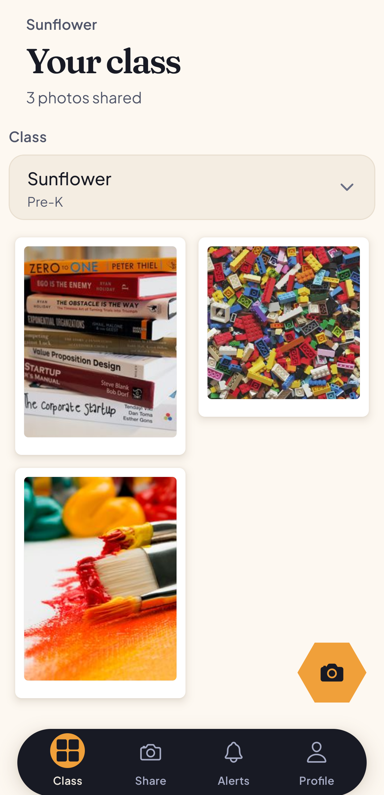

*The teacher dashboard. The class name sits above the heading, the count of
photographs shared sits below it, and the grid holds what has already gone out.*

This is where you land. The heading reads **Your class**, with the class name
above it and a running count such as "20 photos shared" below. Underneath is a
class picker, and under that a grid of the photographs already shared with that
class.

If you teach more than one class, use the picker to move between them. A teacher
only ever sees classes at their own school. Requesting another school's roster
is refused by the server, not hidden by the app.

The round camera button in the corner of the grid takes you straight to the
sharing screen, as does the **Share** tab.

### 3.2 Sharing photographs

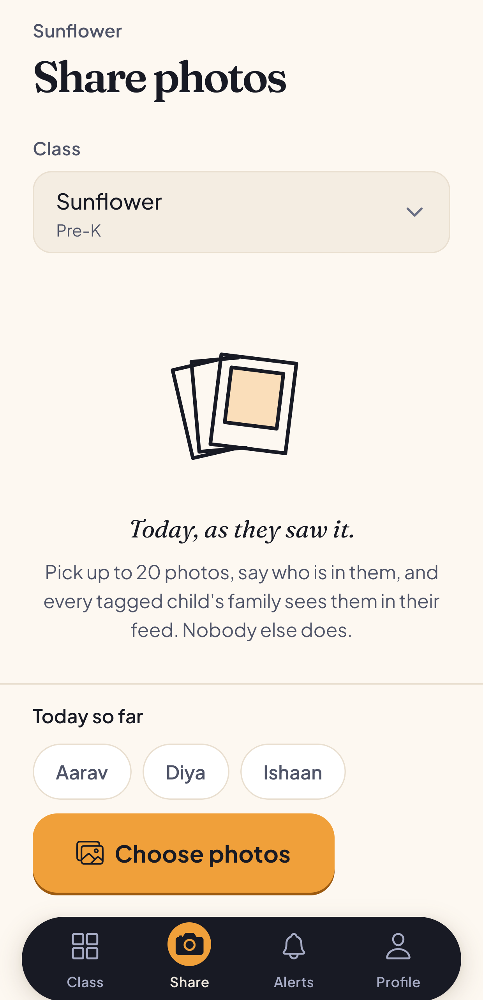

*The Share screen before you pick anything. The class is already selected, and
the rail at the bottom shows who you have photographed so far today.*

The screen opens on the class you teach, already chosen, so you do not have to
set it every time. Change it with the picker if you need to.

Below the picker is the line *"Today, as they saw it."* and the rule stated
plainly: pick up to 20 photos, say who is in them, and every tagged child's
family sees them. Nobody else does.

At the bottom sits a rail of the children in the class, headed **Today so far**.
It stays on screen between batches, because "who have I still not photographed
today" is exactly the question you ask when you have no photographs in hand.

Tap **Choose photos** to open your device's picker and select up to 20 images.

### 3.3 Tagging the children

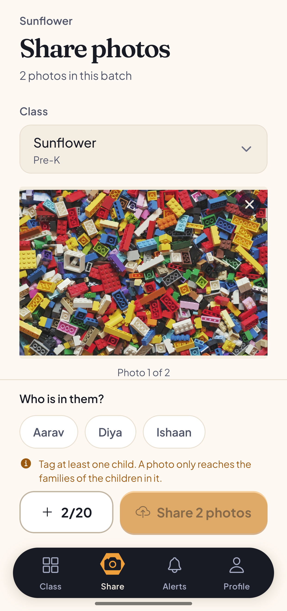

*Photos chosen, and the tagger open. The Share button is greyed out, and the
line above it says why.*

Once photos are chosen, the screen changes. It tells you how many are in the
batch, shows them one at a time with a counter such as "Photo 1 of 2", and the
rail at the bottom is now headed **Who is in them?**.

Tap a child's name to tag them. Tap again to untag. The count of tagged children
appears next to the heading. The **X** on a photo removes it from the batch, and
the **+ 2/20** button adds more.

**The Share button stays disabled until at least one child is tagged**, and an
orange line above it says why: *"Tag at least one child. A photo only reaches
the families of the children in it."*

This is not a formality. A parent's feed is built by looking up which
photographs their children are tagged in. A photograph with no tags is visible
to **no parent at all**, generates no alert, and nothing in the application can
add a tag after the fact. An untagged upload is a photograph that has quietly
gone nowhere and cannot be recovered. That is why the gate exists, and why the
tagger asks before the upload rather than after it.

Tag in the order shown: **pick, then tag, then send**. The alert a parent
receives is generated at the moment a photo is confirmed, from the tags that
exist at that instant.

### 3.4 Sending

Press **Share N photos**. The screen reports progress as it goes, one line
reading how many of the batch are done, and asks you to keep the screen open.
When it finishes it says how many families the batch reached, and offers
**Share more** for the next batch.

A few things the server does on the way through, which matter if something is
refused:

- The file is checked by reading its actual contents, not by trusting what the
  device claims it is. A file that is not really an image is rejected.
- A thumbnail and a colour placeholder are generated for each photo, so a
  parent's feed loads quickly.
- iPhone photos are converted to JPEG on the phone before they are sent. If a
  HEIC file does reach the server it is refused with a message asking you to
  re-save it as JPEG.

### 3.5 Alerts and profile

**Alerts** carries notifications for the teacher. **Profile** shows your name,
role, email and phone, lets you edit your name and phone, and holds **Sign
out**, which asks you to confirm.

---

## 4. For parents

A parent has five tabs: **Diary**, **Moments**, **Orders**, **Alerts** and
**Profile**. Diary leads, because the question a family keeps the app for is
"how has the year gone", not only "what arrived today".

### 4.1 Moments, and switching child

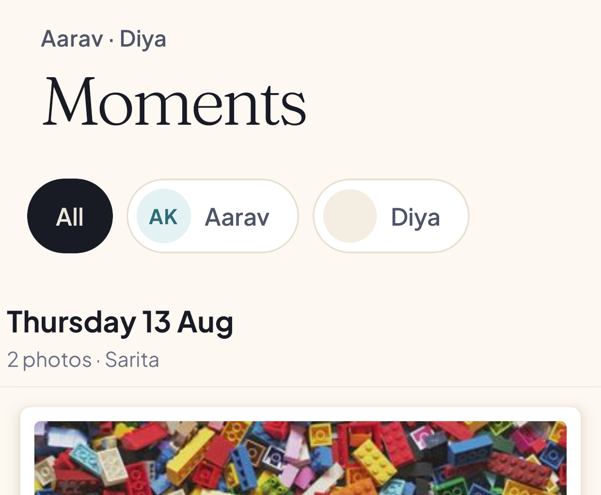

*The child switcher. **All** merges every child's photographs into one wall;
each name filters to that child.*

**Moments** is the photo wall, newest first. If you have more than one child,
a row of chips sits under the heading: **All**, then one chip per child with
their initials. The names of your children appear above the heading.

**All** is the default and merges every child's photographs into one wall. A
photograph that has two of your children in it appears **once**, not twice.

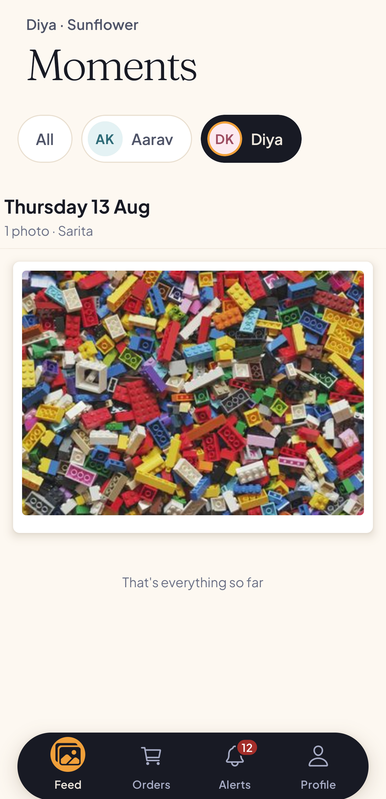

*The same feed after tapping Diya. The wall now holds only photographs Diya is
tagged in, and the heading above names her and her class.*

Tap a child's chip and the wall reloads with only that child's photographs. The
line above the heading changes to that child's name and class.

Photographs are grouped by the day they were taken, each group headed with the
date, a count, and the name of the teacher who took them.

**What you see, and what you do not.** This wall holds photographs your own
children are tagged in. It is not the class album and it is not the school
album. A photograph of another family's child is not filtered out of your view
by the app on your phone; it is never sent to your phone in the first place,
because the server builds the list from the children linked to your account. If
you were to guess the address of a photograph none of your children are in, the
answer is that no such photograph exists as far as your account is concerned.

### 4.2 Opening a photograph

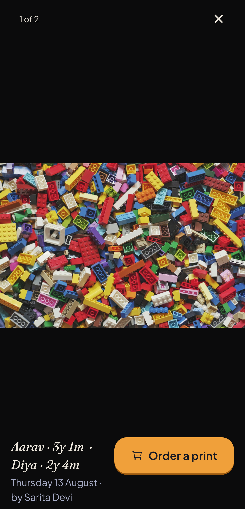

*A photograph opened. The caption names your children and how old each of them
was on the day, then the date and the teacher. **Order a print** is the one
action.*

Tap any photograph to open it. A counter in the corner shows where you are in
the set, and the **X** closes it. You can swipe between photographs without
going back to the wall.

Underneath the picture:

- **The age stamp**, for each of your children in the frame, such as
  "Aarav - 3y 2m". This is the thing worth having later.
- **The date and the teacher** who took it.
- **Order a print**, which opens the ordering sheet described below.

### 4.3 The diary

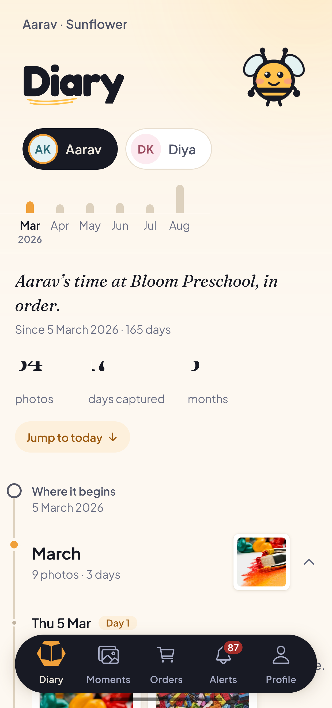

*The diary. One child, from their first photograph to today, with a bar per
month across the top and a summary underneath.*

**Diary** is the same photographs read forwards instead of backwards, for one
child at a time.

At the top is a chip per child, and a bar chart with one bar per month, so you
can see at a glance which months were busy. Underneath is a line naming the
child and their school, the date their first photograph was taken, and how many
days ago that was.

Then three counts: how many photographs there are, how many separate days were
captured, and how many months the diary covers.

**Jump to today** takes you to the most recent month without scrolling for it.

Below that the diary runs in order, starting at **Where it begins** with the
date of the first photograph. Each month is a heading with a count of
photographs and days, a cover picture, and an arrow to open it.

A diary belongs to **one child**. It never merges siblings, because two
children's photographs interleaved into one timeline would be a diary of
neither. Use the chips at the top to switch between your children.

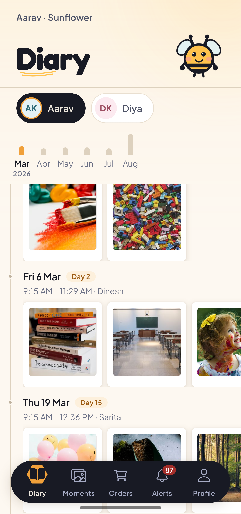

*A month opened. Each day carries its date, how many days into the journey it
was, the span of time the photographs cover, and the teacher who took them.*

Tap a month and it opens into the days it actually happened on. Each day gets a
heading with its date, a day number counting from the first photograph, the
time span the photographs cover, and the name of the teacher behind the camera.
Tap any picture to open it in the same detail view as the feed.

### 4.4 Alerts

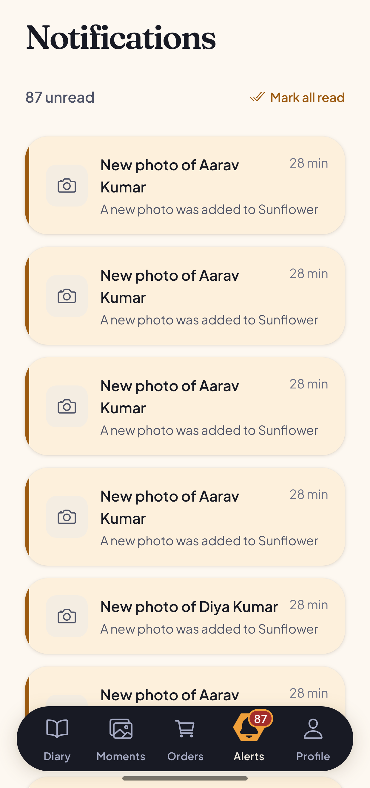

*Notifications. Each one names the child, not the class, and tapping one opens
the photograph.*

**Alerts** lists a notification per new photograph, with an unread count on the
tab itself. Each row reads *"New photo of Aarav Kumar"* with the class
underneath and how long ago it arrived.

These are generated at the moment a teacher confirms a photograph, addressed to
the parents of the children tagged in it. They are not broadcast to the class.

Tap a row to open the photograph it refers to. **Mark all read** at the top
clears a backlog. The list is sorted by how recent each alert is and does not
re-sort itself when you mark something read.

### 4.5 Ordering prints

Open a photograph and tap **Order a print**. A sheet slides up, headed **Order a
print**, with the line "Delivery is included in every price."

1. **Choose a size.** Prices are shown per item and are in Indian rupees. A 4x6
   print is 30 rupees, a 5x7 is 50, an 8x10 is 99. There are also a digital
   copy, a photo book, a fridge magnet and a photo mug.
2. **Choose a quantity**, with the plus and minus controls.
3. **Read the total.** As soon as you pick a size, a summary appears showing the
   item, the quantity, the line total, delivery marked as included, and the
   total.
4. **Enter a delivery address** under "Delivery address". This is required.
5. **Add a note for the school** if you want to. This field is optional.
6. Tap **Place order**, which carries the total in its label.

The button stays disabled until both a size and an address are present, and the
line above it says which one is missing rather than leaving you to guess.

When the order goes through, the sheet replaces itself with a confirmation
naming what you ordered and what it cost, and telling you the school will
confirm it shortly. Tap **Done**.

Two things happen behind the scenes and are worth knowing. **Prices are decided
by the server**, never by the app: your phone sends a product type and a
quantity, never an amount. And **submitting twice does not order twice** - a
double tap, or a retry on a bad connection, returns the same order rather than
creating a second one.

Money is held as whole paise throughout, never as a decimal, so a total cannot
drift by a rounding error.

### 4.6 Order history

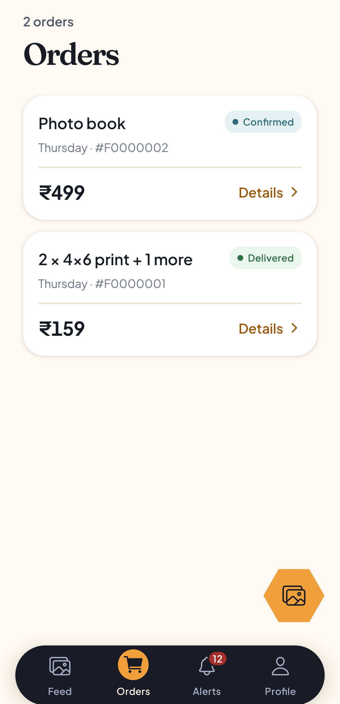

*The Orders tab. One card per order, with what was ordered, when, its order
number, its total and its current stage.*

**Orders** lists every order you have placed, newest first. Each card names what
was ordered, the date, a short order number, the total and a status pill.

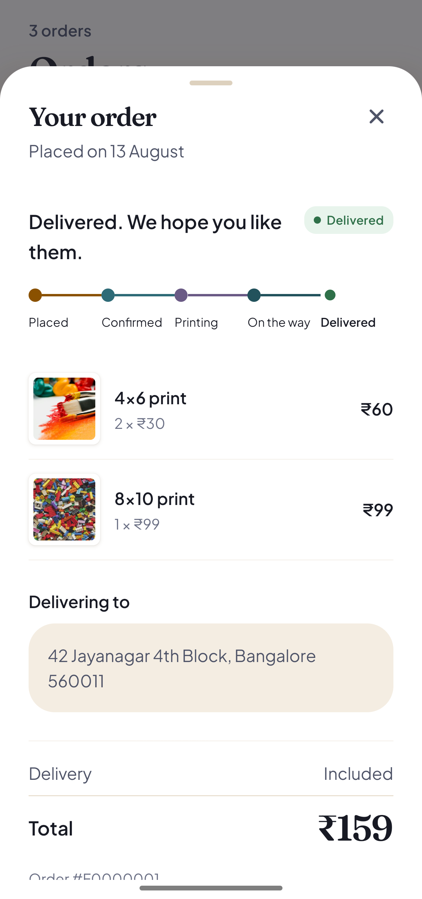

*An order opened. The stages run left to right, the line items show the unit
price and the line total, and the delivery address and grand total sit below.*

Tap **Details** on any card to open it. The sheet shows when the order was
placed, a sentence describing where it has got to, and a rail of the five stages
- Placed, Confirmed, Printing, On the way, Delivered - with the current one
marked.

Under that are the line items, each with a thumbnail, the product, the quantity
and unit price, and the line total. Then the delivery address, the delivery line
marked as included, the grand total, and the order number.

An order can be cancelled from this sheet while it is still at the Placed stage.
Cancelling asks you to confirm and tells you what it means: the order will not
be printed or delivered, and you can order again at any time.

### 4.7 Profile

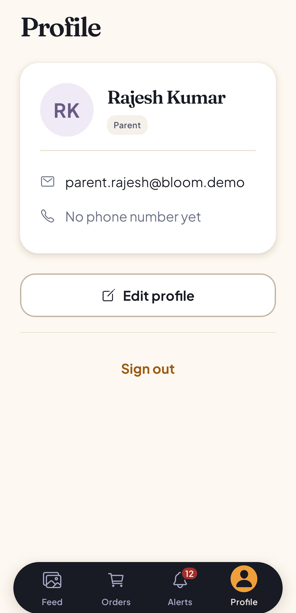

*Profile. Your name and role, your contact details, and sign out.*

**Profile** shows your initials, your name, a pill naming your role, your email
address and your phone number if you have set one.

**Edit profile** opens a sheet where you can change your name and phone number.
The name is the one your school sees on photographs and orders.

**Sign out** asks you to confirm first, then returns you to the login screen.

---

## 5. For administrators

An administrator has six tabs: **Home**, **Users**, **Schools**, **Orders**,
**Alerts** and **Profile**.

An administrator with no school of their own is a platform administrator and
sees every school. This is the only role that crosses school boundaries.
Teachers and parents are confined to their own school by the server, which
refuses a request for another school's data rather than returning an empty list.

### 5.1 Overview

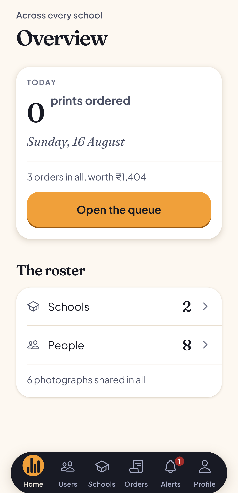

*The administrator dashboard. Today's ordering at the top, the queue one tap
away, and the size of the platform underneath.*

**Home** is headed **Overview**, with "Across every school" above it.

The first card is today: how many prints have been ordered, today's date, and a
line giving the total number of orders and what they are worth. **Open the
queue** goes straight to fulfilment.

Below that, under **The roster**, are the counts that describe the platform: how
many schools, how many people, and how many photographs have been shared in all.
Tapping a row takes you to the matching tab.

### 5.2 Schools and classes

**Schools** lists every site on Hive. The button in the corner adds a school. It
asks for a name, and optionally an address and a phone number.

Tap a school to see its classes, and add a class to it. A class needs a name,
and can carry a year group such as Pre-K.

Tap a class to open its detail screen, which has three parts:

- **Teacher.** Which teacher leads the class. **Change** picks a different one.
- **The children** enrolled in it. The button in the corner adds a child. It
  asks for their name, and optionally a date of birth. Removing a child from
  a class asks you to confirm and states what will happen: the child stays
  enrolled at the school, they are only leaving this class.
- **The parents** who can see each child, reached by tapping a child.

### 5.3 Linking a parent to a child

This is the most consequential thing an administrator does, because it is what
decides who sees a child's photographs.

From a class, tap a child to open the list of parents linked to them, headed
*"Who can see this child's photographs"*. If nobody is linked, the screen says
so plainly: no parent can see that child's photographs until somebody is linked
here.

Tap **Link a parent** to search everyone with a parent account by name or email,
then tap a name to link them. Linking tells you what it means before you do it:
they will see every photograph that child appears in.

To remove a link, tap the unlink control next to a parent. It asks you to
confirm and states the consequence, which is that they will stop seeing that
child's photographs.

**Linking is also what places a parent at a school.** A parent who has signed up
but has never been linked to a child has no school, no photographs and cannot
place an order. Linking them fixes all three.

If you try to link a parent who is already linked to that child, the server
refuses and the message it sends is shown to you as it is, rather than being
replaced with a generic failure.

### 5.4 People

**Users** is headed **People**, with "Everyone who has signed in" above it.
There is no invitation flow; a person appears in this list the first time they
sign in.

Search by name or email, and filter by Teachers, Parents or Admins.

Tap a person to change their role or assign them to a school. Changing a role
asks you to confirm and says that it changes what that person can access.

### 5.5 Fulfilment

**Orders** is the print queue, headed **Fulfilment**. It holds every order from
every school, filterable by stage: Everything, Placed, Confirmed, On the way.

Tap an order to advance it to its next stage. Each change is reported back to
you, and the parent sees the new stage on their own Orders tab.

### 5.6 Alerts and profile

**Alerts** and **Profile** work the same way as they do for the other roles.

---

## 6. Troubleshooting

These are the failures that actually happen, taken from the project's own setup
notes. The full list is in
[`docs/environment-setup.md`](../environment-setup.md).

| What you see | Why | What to do |
|---|---|---|
| The app opens on a phone but every screen fails to load | `EXPO_PUBLIC_API_URL` is set to `localhost`. On the phone, `localhost` is the phone | Set it to the LAN address of the machine running the backend. On macOS, `ipconfig getifaddr en0` |
| The backend exits the moment you start it | Configuration is validated at boot and the process refuses to start on a bad value | Read the error. It names the variable that is wrong |
| Every request comes back unauthorised | `EXPO_PUBLIC_API_URL` points somewhere else, or the app and the backend are pointed at two different databases | Check both env files agree |
| In the browser: Metro reports it cannot resolve `react-dom` or `@lottiefiles/dotlottie-react` | Dependencies were added and never installed after the last pull | `pnpm install` |
| In the browser: the page is blank, the tab title says Hive, and the console is completely empty | A stale bundler cache. An empty console is the tell, because a bundle that fails to parse leaves nothing running to report the error | Restart Expo with `--clear` |
| Sign-in appears to work, then bounces straight back to the login screen | On the web, the session was not being stored. This was fixed | `git pull`, then restart with `--clear` |
| The page renders but every API call fails | The backend is not running, or the API URL points at a machine that is not this one. For a browser session it should be `http://localhost:4000` | Start the backend, or fix `apps/mobile/.env` |
| Photographs upload but never appear | The database migrations are not fully applied, or the storage bucket does not exist | Apply the migrations and check the bucket |
| An order is refused | The product type sent does not match the catalogue the server and database accept | Check the product constants; the client, the validator and the database all have to agree |
| A one-time code never arrives by email | The default mail service is rate limited to a few messages an hour, and `.demo` addresses cannot receive mail at all | Use **"Use a password instead"** |
| The parent feed is empty, or a screen looks wrong for who you are | You are probably signed in as the wrong role | Sign out and sign back in |
| `sharp` will not install | It needs libvips | Debian: `apt install libvips-dev`. Alpine: `apk add vips-dev` |

---

## 7. What the application does not do

Stated plainly, because a manual that implies more than exists is worse than one
that admits the edges.

- **Hive is not deployed.** There is no hosted web address and no downloadable
  APK. It runs on a development machine, and on a phone over the same local
  network. That was a decision rather than an oversight.
- **The browser build is for looking at screens**, not a supported surface. The
  product targets iOS and Android.
- **There is no payment.** An order records what was wanted and where to send
  it. No money changes hands in the application.
- **Push notifications are not implemented.** Alerts appear inside the
  application only.
- **There is no offline mode, no video, and no second language.**
- **A photograph cannot be tagged after it is shared.** This is why the tagging
  gate is placed where it is.
