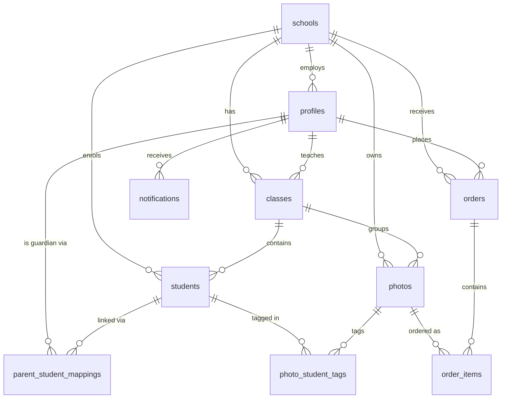

# Database Design

PostgreSQL via Supabase. Ten tables, row level security on all of them, and a
privacy model enforced by the schema rather than by application code.

## Entity relationships



## The privacy pivot

`photo_student_tags` is the only path from a parent to a photo:

```
profiles → parent_student_mappings → students → photo_student_tags → photos
```

There is **no direct relationship** between a parent and a photo. A query that
forgets a join returns nothing rather than everything — the failure mode is
safe by construction.

## Tables

| Table | Purpose | Notable |
|---|---|---|
| `schools` | Top-level tenant | Everything scopes to it |
| `profiles` | Extends `auth.users` | `role` CHECK: teacher, parent, admin |
| `classes` | Classroom groups | Optional `teacher_id` |
| `students` | Enrolled children | `class_id` nullable — a child can be unassigned |
| `parent_student_mappings` | M:N guardians | `UNIQUE (parent_id, student_id)`; a child may have several guardians |
| `photos` | Core content | `status`: processing → ready / failed / archived |
| `photo_student_tags` | **The privacy pivot** | `UNIQUE (photo_id, student_id)` |
| `orders` | Print orders | `idempotency_key UNIQUE` prevents duplicate submission |
| `order_items` | Line items | Prices in integer cents, set server-side |
| `notifications` | In-app alerts | `jsonb` payload for deep links |

## Indexing

Two are worth explaining because they were designed against specific queries
rather than added speculatively:

**`idx_photos_class_feed (class_id, status, created_at DESC, id DESC)`** mirrors
the feed's exact `ORDER BY`, so pagination is an index scan rather than a sort.

**`idx_pst_student_id (student_id) INCLUDE (photo_id)`** lets the feed join
complete without touching the heap — an index-only scan on the hottest query in
the product.

## Row level security

505 lines across all ten tables, with four `SECURITY DEFINER` helpers:
`get_my_role`, `get_my_school_id`, `is_parent_of`, `get_my_student_ids`.

They are `SECURITY DEFINER` for a specific reason: they read `profiles` from
inside policies defined *on* `profiles`, which would otherwise recurse
infinitely.

The parent photo policy is the centrepiece:

```sql
CREATE POLICY photos_parent_select ON photos
    FOR SELECT TO authenticated
    USING (
        get_my_role() = 'parent'
        AND status = 'ready'
        AND EXISTS (
            SELECT 1 FROM photo_student_tags pst
            JOIN parent_student_mappings psm ON psm.student_id = pst.student_id
            WHERE pst.photo_id = photos.id AND psm.parent_id = auth.uid()
        )
    );
```

**Important caveat.** The API holds the service-role key, which is exempt from
RLS by design. These policies protect only queries the mobile client makes
directly to Supabase. Every API endpoint re-implements the same rules in its
service layer — see `docs/architecture.md` §3.

## Triggers

| Trigger | Fires | Does |
|---|---|---|
| `set_updated_at` | before update, 6 tables | Maintains `updated_at` |
| `handle_new_user` | after insert on `auth.users` | Creates the profile; role from signup metadata |
| `notify_parents_on_photo` | photo → `ready` | Notifies each tagged child's parents |
| `notify_teacher_on_upload_complete` | photo → ready/failed | Notifies the uploader |

`notify_parents_on_photo` loops over `photo_student_tags`, so **tags must exist
before the status flips**. The original pipeline flipped first, so the loop
always ran empty and no parent was ever notified — while teachers still got
their own notification, which is why it went unnoticed. Both the app and the
seed script now tag first.

## Migrations

| # | What |
|---|---|
| 00001–00010 | Extensions and the ten core tables |
| 00011 | Row level security, all tables |
| 00012 | Triggers |
| 00013 | Composite indexes |
| 00014 | Profile creation on signup |
| 00015 | Photos storage bucket |
| 00016 | `sha256_hash` nullable — client-side hashing abandoned |
| **00017** | Order money as integer cents |
| **00020** | Photos bucket private; public read dropped |

```bash
pnpm db:migrate   # supabase db push
pnpm db:reset     # rebuild from scratch
```

Forward-only and applied manually, deliberately — migrating on boot is unsafe
once more than one instance runs.

## Known issues

- `photos.s3_key` holds a Supabase Storage path, not an S3 key. The name is
  historical; renaming would touch six files for no functional gain.
- `photos.sha256_hash` and `idx_photos_dedup` exist for deduplication that was
  designed but never wired — the client never computes the hash.
- `photos.caption`, `students.avatar_url` and `schools.logo_url` are defined but
  never populated.
