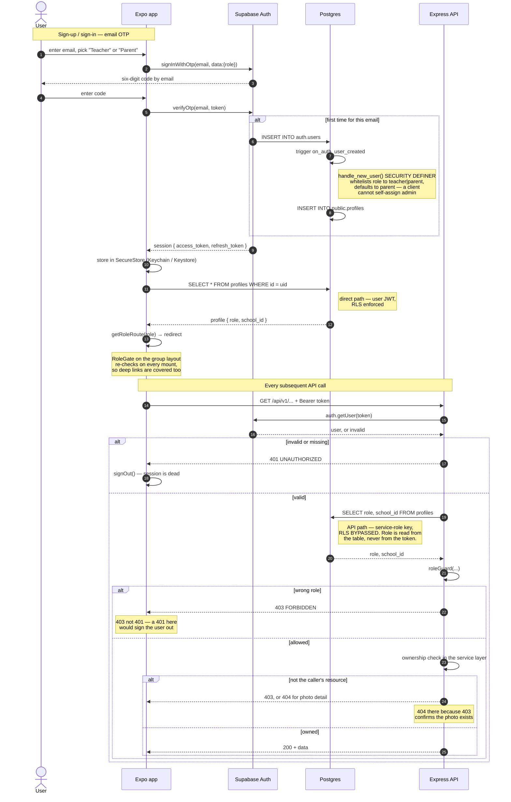

# Hive — Security Design

**Scope:** the whole system — Expo app, Express API, Supabase (Postgres, Auth, Storage).
**Status:** current as of Week 24, after all four streams merged. Sections marked ⚠ describe work that is not finished.
**Source material:** `docs/01-PROJECT-AUDIT-AND-COMPLETION-PLAN.md` (gap IDs `G-xx`), and the plans under `docs/plans/`.

---

## 1. Threat model

### What is being protected

| Asset | Why it matters |
|---|---|
| **Photographs of children** | The reason the product exists and the reason it is regulated. A photo leak is not recoverable — it cannot be rotated like a password. |
| **Child PII** | `students` holds full name, date of birth and class. Combined with a photo this identifies a specific child at a specific location on a specific schedule. |
| **Parent–child mappings** | `parent_student_mappings` is the privacy model. It defines who may see whom. Corrupting it is equivalent to leaking every photo. |
| **Adult PII** | `profiles` holds email and name for teachers, parents and admins. |
| **Service-role key** | Bypasses row level security entirely. Possession is equivalent to full database access. |
| **Session tokens** | Supabase JWTs. Bearer credentials with no possession proof — whoever holds one is the user. |

### Actors

| Actor | Trusted to | Must not be able to |
|---|---|---|
| **Unauthenticated** | Nothing. Reach `/health` only. | Read any photo, any roster, any metadata. |
| **Parent** | See photos their own children are tagged in. | See another family's photos, learn which other children are in a photo, read any roster. |
| **Teacher** | Upload to their own school's classes, tag their own school's students. | Touch another school's classes, students or photos; modify a colleague's photo. |
| **Admin** | Manage schools, classes, students, users across the platform. | — (fully trusted; the last line here is operational, not technical). |
| **Compromised client** | Nothing. | Anything. The app is assumed modified and hostile. |

### Trust boundaries

```
[ Mobile app ]  ── untrusted ──┬──►  [ Express API ]  ──►  [ Supabase Postgres ]
                               │      service-role key         RLS present but
                               │      RLS BYPASSED             bypassed on this path
                               │
                               └──►  [ Supabase ] direct, user JWT
                                      RLS ENFORCED
```

The boundary that matters is the app/API line. Everything on the left is attacker-controlled: the app is open source, `EXPO_PUBLIC_*` values are inlined into the bundle, and a modified build can send any request with a valid token. **No client-side check is a security control.**

---

## 2. Authentication

Supabase Auth, entirely. **There is no custom cryptography anywhere in this codebase** — no hand-rolled hashing, no bespoke token format, no homemade session store. Password hashing is Supabase's bcrypt; JWT signing and verification are Supabase's. This is a deliberate choice, and the correct one: authentication primitives written by a student under deadline are the single most likely place for a catastrophic, invisible bug.

**Flows**

- **Parents and teachers** — email OTP (six-digit code, no password). `supabase.auth.signInWithOtp`.
- **Admins and demo accounts** — email and password, seeded through the Admin API by `scripts/seedAdmin.ts`.

**Profile creation.** The `on_auth_user_created` trigger (`00014_handle_new_user_trigger.sql`) fires `handle_new_user()` after insert on `auth.users` and creates the matching `profiles` row. It runs `SECURITY DEFINER` because no session exists yet at that point. Note the role handling: it reads `raw_user_meta_data->>'role'` — client-supplied — but **whitelists it to `teacher` or `parent`, defaulting to `parent`**. A client cannot self-assign `admin` through signup. Promotion to `admin` is an explicit admin action through `PATCH /admin/users/:id/role`.

**Token verification.** `middleware/auth.ts` extracts the bearer token and calls `supabaseAdmin.auth.getUser(token)`, which validates it against Supabase. It then reads `role` and `school_id` **from the `profiles` table**, never from the token body. This matters: JWT claims are only as trustworthy as the signature, and reading authorization state from the database means a role change takes effect on the next request rather than at token expiry.

**Token storage.** `lib/supabase.ts` uses a `SecureStore` adapter — Keychain on iOS, Keystore-backed encrypted preferences on Android — not `AsyncStorage`.

**Session handling.** `lib/api.ts` signs the user out on any `401`. This is safe only because every authorization failure returns `403`; see §3.

---

## 3. Authorization — defence in depth

Three layers, each with a stated purpose. Confusing them is how the audit's findings happened.

### Layer 1 — `RoleGate` on the client. **UX only. Never trusted.**

`features/auth/components/RoleGate.tsx` wraps each route group and refuses to render it for the wrong role. Its purpose is that a parent never sees an admin screen flash before a redirect. It is trivially removed by anyone running a modified build, and the component's own doc comment says so, so nobody later mistakes it for the boundary.

### Layer 2 — server-side guards and ownership checks. **The real control.**

Two mechanisms:

- **`roleGuard(...roles)`** — coarse. Answers "what kind of user is this?". Returns `403`.
- **Explicit ownership checks in the service layer** — fine. Answers "is this *their* resource?".

The second is mandatory, and here is why:

> **The backend queries exclusively through `supabaseAdmin`, constructed with `SUPABASE_SERVICE_KEY`. The service-role key bypasses row level security by design.**

The 505-line policy set in migration `00011` is therefore never consulted for an API request. It protects only Layer 3. Every endpoint that accepts a resource ID must re-derive authorization itself — and in four places it did not. That single architectural fact is the root cause of G-04, G-08 and G-17.

Current ownership checks:

| Check | Location | Rule |
|---|---|---|
| Photo detail | `feed.service.getPhotoDetails` | Caller must be a parent of a student tagged in the photo |
| School listings | `middleware/roleGuard.assertSchoolAccess` | `admin`, or `req.user.schoolId === :id` |
| Class photo listing | `photo.service.getPhotosByClass` | Class's `school_id` must match the caller's |
| Photo mutation | `photo.service.assertPhotoOwnership` | `admin`, or teacher who uploaded it, at that school |
| Upload target | `photo.service.requestUpload` | Class's `school_id` must match the caller's |

**Status codes are part of the design.**

- **404, not 403, on the photo detail endpoint.** A `403` confirms the photo exists. UUIDs are enumerable, so "exists but forbidden" is itself a disclosure. Refusal is indistinguishable from absence.
- **403, not 401, for a wrong-role caller.** `lib/api.ts` signs out on `401`, so a `roleGuard` returning `401` would log out anyone who touched another role's route. Every `401` in the backend is an authentication failure — missing header, invalid token, absent profile — and every authorization failure is `403`. Test `T-4` pins this.
- **Filtering, not just gating.** `getPhotoDetails` returns only the requesting parent's own children in `taggedStudentIds`. Authorization is not binary: being entitled to the photo does not entitle you to the guest list.

### Layer 3 — row level security. **Last line, covers the direct path.**

Migration `00011` defines policies across all domain tables. They apply to the queries the app makes to Supabase directly with the user's own JWT: `useChildren`, `useClasses`, `getClassStudents` and `authStore.initialize`. On that path RLS is the only control, and it is sufficient.

---

## 4. Findings and remediations

From the Week 14 audit. Severity is the audit's.

| ID | Finding | Severity | Fix | Commit |
|---|---|---|---|---|
| **G-04** | `GET /feed/photos/:id` accepted no user ID. Any parent could read any photo's metadata and its full tagged-student list — a cross-school child roster. | **Critical** | Require a tag on one of the caller's own children; 404 on refusal | `security(feed): enforce parent ownership on the photo detail endpoint` |
| **G-04b** | Even an entitled parent received every tagged student ID. | **Critical** | Return only the caller's own children | `security(feed): return only the requesting parent's tagged children` |
| **G-05** | No route group performed any role check. `hive://(admin)/dashboard` rendered the admin console for a parent. | **Critical** | `RoleGate` on all three group layouts | `security(app): guard parent, teacher and admin route groups by role` |
| **G-08** | `/schools/:id/classes`, `/schools/:id/students` and `GET /photos?classId=` never compared the ID to the caller's school. Any teacher could read another school's roster including dates of birth. | **High** | `assertSchoolAccess`; school check in `getPhotosByClass` | `security(schools): …` · `security(photos): scope class photo listing…` |
| **G-17** | `POST /photos/:id/file` and `/confirm` checked only status. Teacher A could overwrite teacher B's photo file. `/tag` checked school but not uploader. | **High** | `assertPhotoOwnership` on all three | `security(photos): verify photo ownership on file upload, confirm and tag` |
| **G-09** | Five photo routes guarded on `school_admin`, a role the DB `CHECK` rejects, so a real admin could not upload. | Medium | Removed the role platform-wide | `refactor(rbac): remove unsupported school_admin role…` |
| **G-16** | `admin.service.getUsers` interpolated raw input into a PostgREST `.or()` filter. | Medium | Strip DSL metacharacters | `security(admin): sanitise user search…` |
| **G-10** | `seedAdmin.ts` hardcoded `admin@hive.app` / `Admin@123` and printed the password. | High | Environment-provided, no default, never echoed | `security(scripts): move admin seed credentials…` |
| **G-L3** | `auth.ts` logged `req.ip` on every invalid token. | Low | Removed | `security(obs): stop logging client IPs…` |
| **G-L4** | `auth.ts` logged the raw error object, which can embed the request and its bearer token. | Low | `err.message` only | same commit |
| **G-39** | No error tracking. | Medium | Sentry with PII scrubbing, both apps | `feat(obs): integrate Sentry with PII scrubbing…` |

### ⚠ Open

| ID | Finding | Severity | Owner |
|---|---|---|---|
| **G-01** | Order submission is broken three ways; no order can be placed. Not a security issue, but the largest functional gap. | — | Plan 02 |
| **G-45** | Supabase's default SMTP is rate-limited to a handful of emails an hour, so **OTP delivery fails under any real load** — including a live demo. Unowned. | Medium | Plan 01 Step 8 |
| **G-S10** | `CORS_ORIGINS` defaults to `*`. Must be set explicitly at deploy time. | Medium | Plan 09 |
| **S-15** | Supabase project ref committed at `supabase/README_MIGRATIONS.md:20`; keys not yet rotated. | Low | Plan 11 |

**G-02 has since been closed by Plan 03** — the static `/uploads` route is gone, the bucket is private, and files are served through short-lived signed URLs. That changes the reading of this section: photo *files* and photo *metadata* are now both controlled, where previously only the metadata layer was.

One ordering makes them work together, and it is easy to break: `getPhotoDetails` runs the parent-ownership check **before** minting the signed URL. A signed URL grants access to the file itself, so generating one for a caller who is then refused would hand out exactly what the check exists to prevent. Anyone reordering that function needs to know this.

**Nothing in this table has been verified against a running system.** See §8, item 9.

---

## 5. Input validation

Zod at every route boundary, via `middleware/validate.ts`, before any controller runs. Schemas live in `validators/`. `errorHandler` renders `ZodError` as `400 VALIDATION_ERROR` with per-field paths.

Notable rules: UUID format on every ID; `contentType` restricted to `image/jpeg | image/png | image/heic`; `fileSize` capped at 25 MB; `sha256Hash` matched against `^[a-f0-9]{64}$`; admin search capped at 100 characters; pagination `limit` clamped to 1–50.

**PostgREST filter injection (G-16).** `getUsers` built its search filter by interpolating user input:

```ts
query.or(`full_name.ilike.%${search}%,email.ilike.%${search}%`)
```

`or()` parses a comma-separated filter DSL. The characters `,` `(` `)` `.` `*` `%` and `\` are syntax within it, so a search of `x,role.eq.admin` closed the intended clause and appended a new one — widening the result set instead of narrowing it. This is injection in the same shape as SQL injection, against a different parser, and it is worth noting that the project's use of the Supabase client means **no raw SQL is ever concatenated anywhere** — this was the one place a string was built into a query language, and it was the one place with a hole.

Fixed by stripping the metacharacters before interpolation, and skipping the filter entirely when nothing survives.

**Other boundaries.** Body size is capped at 1 MB (`express.json({ limit: '1mb' })`). `helmet` sets standard security headers. `express-rate-limit` applies a global limit — but see G-20: the proxy configuration currently undermines its keying.

---

## 6. File upload security

| Control | Status |
|---|---|
| Size limit — 25 MB, at both the validator and multer | ✅ |
| Extension/`Content-Type` allowlist | ✅ |
| Magic-byte verification | ✅ `sharp` reads the header rather than trusting the declared MIME type (G-40) |
| Path traversal | ✅ Not possible — the storage path is server-generated as `photos/{schoolId}/{classId}/{uuid}.{ext}`; the client's filename is stored as metadata only and never used to build a path |
| Ownership on write | ✅ `assertPhotoOwnership` (G-17) |
| Private bucket + signed URLs | ✅ Bucket private, static route deleted, short-lived signed URLs (G-02) |
| Temp file cleanup on rejection | ✅ `saveUploadedFile` unlinks when the ownership check refuses |

The path-traversal property is worth calling out because it is easy to get wrong and this codebase gets it right by construction: `requestUpload` generates the key from a fresh UUID and IDs it has already validated, so no client-supplied string ever reaches `path.join`.

---

## 7. Secrets

**Repository scan** (Week 22, `git grep` across all tracked files):

| Pattern | Result |
|---|---|
| JWTs (`eyJ…`) | **0** |
| AWS access keys (`AKIA…`) | **0** |
| Stripe keys (`sk_live` / `pk_live` / `sk_test`) | **0** |
| PEM private keys | **0** |
| Tracked `.env` files | **0** |
| Hardcoded credentials | **0** — `Admin@123` was the only one and was removed (G-10) |

`.env`, `.env.local`, `.env.*.local` and `.env.test` are gitignored; only `.env.example`, `.env.test.example` are committed, with placeholder values.

**Key handling**

- `SUPABASE_SERVICE_KEY` is backend-only. It bypasses RLS, so it must never be bundled into the app. The mobile app uses `EXPO_PUBLIC_SUPABASE_ANON_KEY`, which is subject to RLS and is meant to be public.
- Anything named `EXPO_PUBLIC_*` is **inlined into the app bundle at build time and is not a secret**. Treat it as published.
- ⚠ The Supabase project ref `fhvwsmtivwtmbdscdoyz` is committed at `supabase/README_MIGRATIONS.md:20` (audit S-15). A project ref is semi-public and low risk on its own, but **keys should be rotated before final submission**.

**Error reporting.** Sentry is off unless a DSN is set. `beforeSend` on both apps walks the entire event — request, extra, contexts, exception values, stack frame variables, breadcrumbs — redacting sensitive keys and regex-matching bearer tokens, JWTs, email addresses and storage URLs. `http`/`fetch` breadcrumbs are dropped wholesale because they record full request URLs, which here means signed photo URLs. On mobile, `attachScreenshot` and `attachViewHierarchy` are disabled: a screenshot of this app is by definition a photograph of a child.

The scrubber has been exercised against a synthetic event carrying a JWT, two email addresses, a client IP, a signed storage URL, an `/uploads` URL, a password field and a hostname. None survived. A user-agent string and a student's first name did, confirming it redacts targeted values rather than blanking everything.

---

## 8. Known limitations

Stated plainly. Every one of these is a real gap.

1. **⚠ Signed URLs are bearer credentials.** Anyone holding one can fetch the photo until it expires, with no further check — so their lifetime is the security parameter, and forwarding one forwards the photo. This is the residue of G-02, not a regression: it is the accepted trade-off of the private-bucket design.
2. **OTP lockout is client-side only.** `useOTP.ts` tracks attempts and lockout in React state, which resets on remount and is absent entirely from a modified client. The real protection is Supabase's own rate limiting. The lockout UI is a courtesy to honest users, not a control.
3. **OTP delivery is rate-limited by Supabase's default SMTP (G-45)** and no custom SMTP is configured, so codes stop arriving under load. Unowned, and it fails during a live demo.
4. **No audit log.** There is no record of who viewed which photo, or who changed a role. For a product handling children's images this is the most significant *missing* control rather than a broken one — a breach could not be scoped after the fact.
5. **No 2FA**, including for admin accounts.
6. **No account lockout or breach-password checking** on the seeded password accounts.
7. **No automated revocation.** Signing out clears the local session; the JWT remains valid until it expires.
7. **Rate limiting is per-instance and in-memory** — `express-rate-limit`'s
   default store does not hold across multiple instances, so the effective
   limit multiplies by the instance count.
8. **No password reset flow for the admin account.** Recovery means re-running
   `pnpm seed:admin` with new environment values.
8. **Authorization is enforced in application code, not the database, on the API path.** This is a consequence of the service-role key and it means a new endpoint that forgets its ownership check is insecure by default. RLS would be secure by default. Rewriting the backend to use per-request user tokens would fix this class of bug outright, and is the single change that would most improve this system's security posture. It was not attempted within the project's scope.
9. **⚠ The security fixes in §4 have not been verified against a running system.** No `.env` exists in this repository, so the backend cannot boot. The IDOR fixes and route guards are reviewed code and passing typechecks, not observed behaviour. `scripts/verify-security.sh` (Plan 11) exists to run these checks once a deployment does. Until it has been run, treat §4 as "believed fixed", not "confirmed fixed".
10. **⚠ The test suite has never executed.** 12 of Plan 08's 36 tests are written; there is no test Supabase project to run them against, and the sabotage exercise that would prove they detect anything has not been done.

---

## 9. Verification

The runtime checklist lives in `docs/environment-setup.md` §7 and in
`scripts/verify-security.sh`, which runs it against a deployed instance and
exits with the failure count.

The checks that matter most: an unsigned or expired Storage URL must be
rejected; a cross-family photo request must return **404**; a cross-school
student listing must return **403**; a teacher writing to another teacher's
photo must return **403**; and a triggered 500 must not leak a stack trace.

**None of these has been executed.** There is no `.env` in the repository and
nothing is deployed, so every remediation in §4 is written and compiled, not
proven. `verify-security.sh` reports skipped checks separately from passes for
exactly this reason — a run with skips does not verify this document.

---

## Appendix — Authentication sequence (G-3)



---

*Hive · Nagachaitanya · Week 22*
