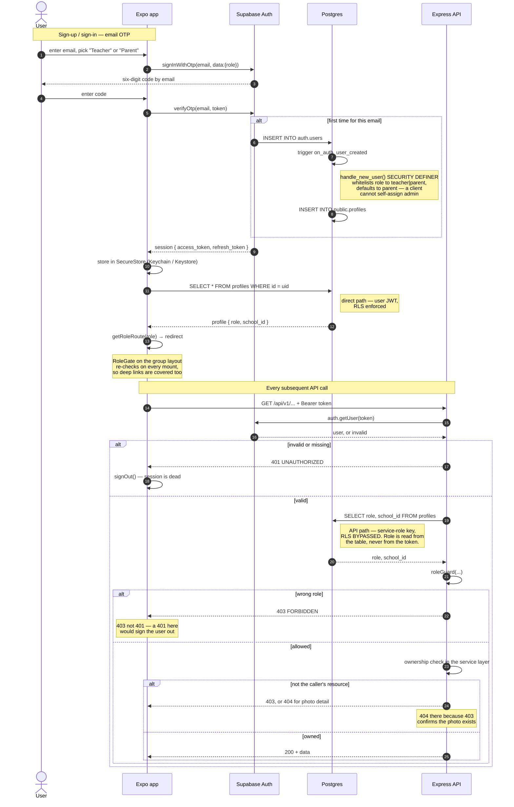

# Hive — Security Design

**Scope:** the whole system — Expo app, Express API, Supabase (Postgres, Auth, Storage).
**Status:** current as of Week 24, after all four streams merged. Sections marked ⚠ describe work that is not finished.
**Source material:** `docs/01-PROJECT-AUDIT-AND-COMPLETION-PLAN.md` (gap IDs `G-xx`), and the plans under `docs/plans/`.

---

## 1. Threat model

### What is being protected

| Asset | Why it matters |
|---|---|
| **Photographs of children** | The reason the product exists and the reason it is regulated. A photo leak is not recoverable — it cannot be rotated like a password. |
| **Child PII** | `students` holds full name, date of birth and class. Combined with a photo this identifies a specific child at a specific location on a specific schedule. |
| **Parent–child mappings** | `parent_student_mappings` is the privacy model. It defines who may see whom. Corrupting it is equivalent to leaking every photo. |
| **Adult PII** | `profiles` holds email and name for teachers, parents and admins. |
| **Service-role key** | Bypasses row level security entirely. Possession is equivalent to full database access. |
| **Session tokens** | Supabase JWTs. Bearer credentials with no possession proof — whoever holds one is the user. |

### Actors

| Actor | Trusted to | Must not be able to |
|---|---|---|
| **Unauthenticated** | Nothing. Reach `/health` only. | Read any photo, any roster, any metadata. |
| **Parent** | See photos their own children are tagged in. | See another family's photos, learn which other children are in a photo, read any roster. |
| **Teacher** | Upload to their own school's classes, tag their own school's students. | Touch another school's classes, students or photos; modify a colleague's photo. |
| **Admin** | Manage schools, classes, students, users across the platform. | — (fully trusted; the last line here is operational, not technical). |
| **Compromised client** | Nothing. | Anything. The app is assumed modified and hostile. |

### Trust boundaries

```
[ Mobile app ]  ── untrusted ──┬──►  [ Express API ]  ──►  [ Supabase Postgres ]
                               │      service-role key         RLS present but
                               │      RLS BYPASSED             bypassed on this path
                               │
                               └──►  [ Supabase ] direct, user JWT
                                      RLS ENFORCED
```

The boundary that matters is the app/API line. Everything on the left is attacker-controlled: the app is open source, `EXPO_PUBLIC_*` values are inlined into the bundle, and a modified build can send any request with a valid token. **No client-side check is a security control.**

---

## 2. Authentication

Supabase Auth, entirely. **There is no custom cryptography anywhere in this codebase** — no hand-rolled hashing, no bespoke token format, no homemade session store. Password hashing is Supabase's bcrypt; JWT signing and verification are Supabase's. This is a deliberate choice, and the correct one: authentication primitives written by a student under deadline are the single most likely place for a catastrophic, invisible bug.

**Flows**

- **Parents and teachers** — email OTP (six-digit code, no password). `supabase.auth.signInWithOtp`.
- **Admins and demo accounts** — email and password, seeded through the Admin API by `scripts/seedAdmin.ts`.

**Profile creation.** The `on_auth_user_created` trigger (`00014_handle_new_user_trigger.sql`) fires `handle_new_user()` after insert on `auth.users` and creates the matching `profiles` row. It runs `SECURITY DEFINER` because no session exists yet at that point. Note the role handling: it reads `raw_user_meta_data->>'role'` — client-supplied — but **whitelists it to `teacher` or `parent`, defaulting to `parent`**. A client cannot self-assign `admin` through signup. Promotion to `admin` is an explicit admin action through `PATCH /admin/users/:id/role`.

**Token verification.** `middleware/auth.ts` extracts the bearer token and calls `supabaseAdmin.auth.getUser(token)`, which validates it against Supabase. It then reads `role` and `school_id` **from the `profiles` table**, never from the token body. This matters: JWT claims are only as trustworthy as the signature, and reading authorization state from the database means a role change takes effect on the next request rather than at token expiry.

**Token storage.** `lib/supabase.ts` uses a `SecureStore` adapter — Keychain on iOS, Keystore-backed encrypted preferences on Android — not `AsyncStorage`.

**Session handling.** `lib/api.ts` signs the user out on any `401`. This is safe only because every authorization failure returns `403`; see §3.

---

## 3. Authorization — defence in depth

Three layers, each with a stated purpose. Confusing them is how the audit's findings happened.

### Layer 1 — `RoleGate` on the client. **UX only. Never trusted.**

`features/auth/components/RoleGate.tsx` wraps each route group and refuses to render it for the wrong role. Its purpose is that a parent never sees an admin screen flash before a redirect. It is trivially removed by anyone running a modified build, and the component's own doc comment says so, so nobody later mistakes it for the boundary.

### Layer 2 — server-side guards and ownership checks. **The real control.**

Two mechanisms:

- **`roleGuard(...roles)`** — coarse. Answers "what kind of user is this?". Returns `403`.
- **Explicit ownership checks in the service layer** — fine. Answers "is this *their* resource?".

The second is mandatory, and here is why:

> **The backend queries exclusively through `supabaseAdmin`, constructed with `SUPABASE_SERVICE_KEY`. The service-role key bypasses row level security by design.**

The 545-line policy set in migration `00011` is therefore never consulted for an API request. It protects only Layer 3. Every endpoint that accepts a resource ID must re-derive authorization itself — and in four places it did not. That single architectural fact is the root cause of G-04, G-08 and G-17.

Current ownership checks:

| Check | Location | Rule |
|---|---|---|
| Photo detail | `feed.service.getPhotoDetails` | Caller must be a parent of a student tagged in the photo |
| School listings | `middleware/roleGuard.assertSchoolAccess` | `admin`, or `req.user.schoolId === :id` |
| Class photo listing | `photo.service.getPhotosByClass` | Class's `school_id` must match the caller's |
| Photo mutation | `photo.service.assertPhotoOwnership` | `admin`, or teacher who uploaded it, at that school |
| Upload target | `photo.service.requestUpload` | Class's `school_id` must match the caller's |

**Status codes are part of the design.**

- **404, not 403, on the photo detail endpoint.** A `403` confirms the photo exists. UUIDs are enumerable, so "exists but forbidden" is itself a disclosure. Refusal is indistinguishable from absence.
- **403, not 401, for a wrong-role caller.** `lib/api.ts` signs out on `401`, so a `roleGuard` returning `401` would log out anyone who touched another role's route. Every `401` in the backend is an authentication failure — missing header, invalid token, absent profile — and every authorization failure is `403`. Test `T-4` pins this.
- **Filtering, not just gating.** `getPhotoDetails` returns only the requesting parent's own children in `taggedStudentIds`. Authorization is not binary: being entitled to the photo does not entitle you to the guest list.

### Layer 3 — row level security. **Last line, covers the direct path.**

Migration `00011` defines policies across all domain tables. They apply to the queries the app makes to Supabase directly with the user's own JWT: `useChildren`, `useClasses`, `getClassStudents` and `authStore.initialize`. On that path RLS is the only control, and it is sufficient.

---

## 4. Findings and remediations

From the Week 14 audit. Severity is the audit's.

| ID | Finding | Severity | Fix | Commit |
|---|---|---|---|---|
| **G-04** | `GET /feed/photos/:id` accepted no user ID. Any parent could read any photo's metadata and its full tagged-student list — a cross-school child roster. | **Critical** | Require a tag on one of the caller's own children; 404 on refusal | `security(feed): enforce parent ownership on the photo detail endpoint` |
| **G-04b** | Even an entitled parent received every tagged student ID. | **Critical** | Return only the caller's own children | `security(feed): return only the requesting parent's tagged children` |
| **G-05** | No route group performed any role check. `hive://(admin)/dashboard` rendered the admin console for a parent. | **Critical** | `RoleGate` on all three group layouts | `security(app): guard parent, teacher and admin route groups by role` |
| **G-08** | `/schools/:id/classes`, `/schools/:id/students` and `GET /photos?classId=` never compared the ID to the caller's school. Any teacher could read another school's roster including dates of birth. | **High** | `assertSchoolAccess`; school check in `getPhotosByClass` | `security(schools): …` · `security(photos): scope class photo listing…` |
| **G-17** | `POST /photos/:id/file` and `/confirm` checked only status. Teacher A could overwrite teacher B's photo file. `/tag` checked school but not uploader. | **High** | `assertPhotoOwnership` on all three | `security(photos): verify photo ownership on file upload, confirm and tag` |
| **G-09** | Five photo routes guarded on `school_admin`, a role the DB `CHECK` rejects, so a real admin could not upload. | Medium | Removed the role platform-wide | `refactor(rbac): remove unsupported school_admin role…` |
| **G-16** | `admin.service.getUsers` interpolated raw input into a PostgREST `.or()` filter. | Medium | Strip DSL metacharacters | `security(admin): sanitise user search…` |
| **G-10** | `seedAdmin.ts` hardcoded `admin@hive.app` / `Admin@123` and printed the password. | High | Environment-provided, no default, never echoed | `security(scripts): move admin seed credentials…` |
| **G-L3** | `auth.ts` logged `req.ip` on every invalid token. | Low | Removed | `security(obs): stop logging client IPs…` |
| **G-L4** | `auth.ts` logged the raw error object, which can embed the request and its bearer token. | Low | `err.message` only | same commit |
| **G-39** | No error tracking. | Medium | Sentry with PII scrubbing, both apps | `feat(obs): integrate Sentry with PII scrubbing…` |
| **S-16** | `createOrder` attributed the order to `req.user.schoolId` rather than to the school that owns the photograph. Because `mapParentToStudent` back-fills a parent's `school_id` only when empty, a parent with children at two schools had every order filed under whichever school linked them first — so **an admin at school A could list an order for a school B photograph**, including the parent's shipping address, in their own fulfilment queue. Scoped deliberately: the leak is order metadata, not photo content, because `withThumbnailUrls` is reached only from the parent-scoped `getOrderById`, so no signed URL for the other school's photograph was ever issued to that admin. Authorization to *order* was never wrong — that is by photo tag. | Medium | Derive the school from `photos.school_id` (`NOT NULL`); refuse a cross-school basket with 400 `ORDER_SPANS_SCHOOLS` | `fix(orders): file an order under the photo's school` (16 Aug) |

### ⚠ Open

| ID | Finding | Severity | Owner |
|---|---|---|---|
| **G-45** | Supabase's default SMTP is rate-limited to a handful of emails an hour, so **OTP delivery fails under any real load**. **Accepted, 16 Aug — out of project scope.** Not remediated. It is accepted only because no path in this project sends an OTP: every demo and test account signs in with a password. Any deployment that enables email sign-in inherits this finding unmitigated and must configure custom SMTP first. | Medium | Accepted — was Plan 01 Step 8 |
| **G-S10** | `CORS_ORIGINS` defaults to `*`. Must be set explicitly at deploy time. **Untriggered rather than fixed**: deployment is out of scope as of 16 Aug, so no origin is ever configured and the default is never exercised in anger. The defect stands for whoever deploys first. | Medium | Deferred with deployment |
| **S-15** | Supabase project ref committed at `supabase/README_MIGRATIONS.md:20`; keys not yet rotated. **Accepted, 16 Aug.** The ref identifies a project, not a credential; the service-role key is gitignored and was never committed. Rotation remains advisable before any public release. | Low | Accepted |

**G-01 has been closed** and is no longer listed here. A parent placed a real
order — 201, `total_cents: 998` for 2 × `print_4x6` at 499 — and a repeated
idempotency key returned the same order rather than a duplicate. It sat in this
table for weeks after it was fixed.

**G-02 has since been closed by Plan 03** — the static `/uploads` route is gone, the bucket is private, and files are served through short-lived signed URLs. That changes the reading of this section: photo *files* and photo *metadata* are now both controlled, where previously only the metadata layer was.

One ordering makes them work together, and it is easy to break: `getPhotoDetails` runs the parent-ownership check **before** minting the signed URL. A signed URL grants access to the file itself, so generating one for a caller who is then refused would hand out exactly what the check exists to prevent. Anyone reordering that function needs to know this.

**Verified against a running system.** `scripts/verify-security.sh` ran for the
first time on 1 August 2026 - **26 passed, 0 failed, 3 skipped** - was
re-run on 11 August after the 9 August correctness sweep: **27 passed, 0
failed, 2 skipped** - and was run again on 16 August, once a forced-500 route
existed: **29 passed, 0 failed, 1 skipped**.
`packages/backend/tests/authorization.test.ts` covers the same ground on every
test run; the suite is **247 tests across 9 files**. The full record of all
three runs, including what they do *not* cover, is in §9.

One entry in this table was never actually being tested. See §9.

---

## 5. Input validation

Zod at every route boundary, via `middleware/validate.ts`, before any controller runs. Schemas live in `validators/`. `errorHandler` renders `ZodError` as `400 VALIDATION_ERROR` with per-field paths.

Notable rules: UUID format on every ID; `contentType` restricted to `image/jpeg | image/png | image/heic`; `fileSize` capped at 25 MB; `sha256Hash` matched against `^[a-f0-9]{64}$`; admin search capped at 100 characters; pagination `limit` clamped to 1–50.

**PostgREST filter injection (G-16).** `getUsers` built its search filter by interpolating user input:

```ts
query.or(`full_name.ilike.%${search}%,email.ilike.%${search}%`)
```

`or()` parses a comma-separated filter DSL. The characters `,` `(` `)` `.` `*` `%` and `\` are syntax within it, so a search of `x,role.eq.admin` closed the intended clause and appended a new one — widening the result set instead of narrowing it. This is injection in the same shape as SQL injection, against a different parser, and it is worth noting that the project's use of the Supabase client means **no raw SQL is ever concatenated anywhere** — this was the one place a string was built into a query language, and it was the one place with a hole.

Fixed by stripping the metacharacters before interpolation, and skipping the filter entirely when nothing survives.

**Other boundaries.** Body size is capped at 1 MB (`express.json({ limit: '1mb' })`). `helmet` sets standard security headers. `express-rate-limit` applies a global limit — but see G-20: the proxy configuration currently undermines its keying.

---

## 6. File upload security

| Control | Status |
|---|---|
| Size limit — 25 MB, at both the validator and multer | ✅ |
| Extension/`Content-Type` allowlist | ✅ |
| Magic-byte verification | ✅ `sharp` reads the header rather than trusting the declared MIME type (G-40) |
| Path traversal | ✅ Not possible — the storage path is server-generated as `photos/{schoolId}/{classId}/{uuid}.{ext}`; the client's filename is stored as metadata only and never used to build a path |
| Ownership on write | ✅ `assertPhotoOwnership` (G-17) |
| Private bucket + signed URLs | ✅ Bucket private, static route deleted, short-lived signed URLs (G-02) |
| Temp file cleanup on rejection | ✅ `saveUploadedFile` unlinks when the ownership check refuses |

The path-traversal property is worth calling out because it is easy to get wrong and this codebase gets it right by construction: `requestUpload` generates the key from a fresh UUID and IDs it has already validated, so no client-supplied string ever reaches `path.join`.

---

## 7. Secrets

**Repository scan** (Week 22, `git grep` across all tracked files):

| Pattern | Result |
|---|---|
| JWTs (`eyJ…`) | **0** |
| AWS access keys (`AKIA…`) | **0** |
| Stripe keys (`sk_live` / `pk_live` / `sk_test`) | **0** |
| PEM private keys | **0** |
| Tracked `.env` files | **0** |
| Hardcoded credentials | **0** — `Admin@123` was the only one and was removed (G-10) |

`.env`, `.env.local`, `.env.*.local` and `.env.test` are gitignored; only `.env.example`, `.env.test.example` are committed, with placeholder values.

**Key handling**

- `SUPABASE_SERVICE_KEY` is backend-only. It bypasses RLS, so it must never be bundled into the app. The mobile app uses `EXPO_PUBLIC_SUPABASE_ANON_KEY`, which is subject to RLS and is meant to be public.
- Anything named `EXPO_PUBLIC_*` is **inlined into the app bundle at build time and is not a secret**. Treat it as published.
- ⚠ The Supabase project ref `fhvwsmtivwtmbdscdoyz` is committed at `supabase/README_MIGRATIONS.md:20` (audit S-15). A project ref is semi-public and low risk on its own, but **keys should be rotated before final submission**.

**Error reporting.** Sentry is off unless a DSN is set. `beforeSend` on both apps walks the entire event — request, extra, contexts, exception values, stack frame variables, breadcrumbs — redacting sensitive keys and regex-matching bearer tokens, JWTs, email addresses and storage URLs. `http`/`fetch` breadcrumbs are dropped wholesale because they record full request URLs, which here means signed photo URLs. On mobile, `attachScreenshot` and `attachViewHierarchy` are disabled: a screenshot of this app is by definition a photograph of a child.

The scrubber has been exercised against a synthetic event carrying a JWT, two email addresses, a client IP, a signed storage URL, an `/uploads` URL, a password field and a hostname. None survived. A user-agent string and a student's first name did, confirming it redacts targeted values rather than blanking everything.

---

## 8. Known limitations

Stated plainly. Every one of these is a real gap.

1. **⚠ Signed URLs are bearer credentials.** Anyone holding one can fetch the photo until it expires, with no further check — so their lifetime is the security parameter, and forwarding one forwards the photo. This is the residue of G-02, not a regression: it is the accepted trade-off of the private-bucket design.
2. **OTP lockout is client-side only.** `useOTP.ts` tracks attempts and lockout in React state, which resets on remount and is absent entirely from a modified client. The real protection is Supabase's own rate limiting. The lockout UI is a courtesy to honest users, not a control.
3. **OTP delivery is rate-limited by Supabase's default SMTP (G-45)** and no custom SMTP is configured, so codes stop arriving under load. **Accepted as out of scope on 16 August** — not fixed. The reasoning is narrow and worth stating precisely: no path this project demonstrates or tests sends an OTP, because every account signs in with a password, so the rate limit is never reached. That makes the finding *unreachable here*, not *absent*. Enabling email sign-in re-exposes it immediately.
4. **No audit log.** There is no record of who viewed which photo, or who changed a role. For a product handling children's images this is the most significant *missing* control rather than a broken one — a breach could not be scoped after the fact.
5. **No 2FA**, including for admin accounts.
6. **No account lockout or breach-password checking** on the seeded password accounts.
7. **No automated revocation.** Signing out clears the local session; the JWT remains valid until it expires.
8. **Rate limiting is per-instance and in-memory** — `express-rate-limit`'s
   default store does not hold across multiple instances, so the effective
   limit multiplies by the instance count.
9. **No password reset flow for the admin account.** Recovery means re-running
   `pnpm seed:admin` with new environment values.
10. **Authorization is enforced in application code, not the database, on the API path.** This is a consequence of the service-role key and it means a new endpoint that forgets its ownership check is insecure by default. RLS would be secure by default. Rewriting the backend to use per-request user tokens would fix this class of bug outright, and is the single change that would most improve this system's security posture. It was not attempted within the project's scope.
11. **The §4 fixes are now observed behaviour, not reviewed code** — see §9 for the run and its limits. What remains true is narrower: nothing has been verified against a *deployed* instance over HTTPS, because nothing is deployed — and as of 16 August deployment is out of scope, so this will not change. It is a permanent limitation of this submission rather than a pending task, which is why the security script's honest result is **29 passed, 0 failed, 1 skipped** and must never be quoted as 30/30.
12. **No audit of who has held a signed URL.** Related to item 1: because signed URLs are bearer credentials and there is no audit log, a leaked URL leaves no trace either at issue time or at use time.

---

## 9. Verification

The runtime checklist lives in `docs/environment-setup.md` §7 and in
`scripts/verify-security.sh`, which runs it against any reachable instance —
local or deployed — and exits with the failure count.

The checks that matter most: an unsigned or expired Storage URL must be
rejected; a cross-family photo request must return **404**; a cross-school
student listing must return **403**; a teacher writing to another teacher's
photo must return **403**; and a triggered 500 must not leak a stack trace.

### The run — 1 August 2026

`verify-security.sh` executed for the first time, against a backend booted with
`NODE_ENV=production` over the seeded demo dataset:

```
passed 26   failed 0   skipped 3
```

**Reproduced from cold on 2 August** — stack stopped and restarted, database
truncated by the test suite, re-seeded, backend rebooted — same result. So this
is a repeatable procedure, not a one-off reading.

| § | Checks | Result |
|---|---|---|
| 2 · G-02 | `/uploads/<random>`, `/uploads/<real key>` | 404, 404 — the static route is gone |
| 3 · G-04 | parent A → another family's photo; own photo; unauthenticated | **404**, 200, 401 |
| 3 · G-04b | `taggedStudentIds` on an entitled request | only the caller's own children |
| 4 · G-08 | teacher → another school's students / classes / class photos | **403 ×3**; own school 200; admin 200 |
| 5 · G-17 | teacher → a **same-school colleague's** photo `/confirm`, `/tag`, `/file` | **403 ×3** |
| 6 · G-05 | parent → `/admin/*`; unauthenticated; garbage token | 403, 403, **401** |
| 8 | CORS with `Origin: https://evil.example` | not reflected, not `*` |
| 10 | secret scan, tracked `.env` files | clean |

Separately confirmed in the same session:

- **Rate limiting** — a 429 arrived at request 77 of a 100-per-15-minute window
  (the window was already partly consumed by the verification run itself).
- **`/health` under database loss** — Supabase stopped mid-run: **503**,
  `"status":"degraded"`, `"database":"error"`. Previously untested.
- **RLS on the client path** — the anon key against `profiles` and `photos`
  returns `[]`, not a dump.
- **G-10** — `seed:admin` does not echo the password.

### What the 1 August run did not cover

Three checks skipped, and the reasons are not interchangeable:

1. **Transport (§8) — skipped, and it should be.** The target was
   `localhost`, and nothing is deployed. HTTPS, HSTS and real CORS behaviour
   remain unverified and cannot be verified until there is a hosted URL.
2. **Rate limiting (§9) — opt-in, run separately.** Confirmed above.
3. **The 500 error shape (§7) — unreachable by design, not skipped by
   accident.** `FORCE_500_PATH` needs a route that reliably 500s
   unauthenticated. There is none: every `/api/v1/*` route sits behind
   `authenticate`, and that middleware answers **401** on any Supabase failure
   — verified by stopping Supabase mid-request. So the anonymous probe can
   never see a 500. The property itself *is* covered, by `errors.test.ts` T-34,
   which exercises the real `errorHandler` with `NODE_ENV=production` and
   asserts no internal message and no stack trace in the body.

**The run was against a local Supabase stack**, not `hive-dev` or a deployment:
Postgres, GoTrue, Storage and all 19 migrations, driven through the real Express
app. That is enough to prove the authorization logic; it is not evidence about
how any hosted project is configured. Re-run against the deployed URL when one
exists — `verify:env` prints the environment, and `STRICT=1` makes skips count.

### The run — 11 August 2026

Re-run after the 9 August correctness sweep, which had touched the rate
limiter, the CORS configuration and the error handler — three of the things
this script exists to check. Same procedure as the 1 August run: a backend
booted `NODE_ENV=production` over the seeded demo dataset.

```
passed 27   failed 0   skipped 2
```

One more pass and one fewer skip than 1 August, because the rate-limit check
(§9) now runs inside the script instead of being confirmed by hand beside it.
The total attempted is 29 either way. Recorded in `701c999`.

**Why the script had never run in full before.** `verify:env` signs in as the
seeded demo accounts and prints the tokens the script needs, and it requires
`SUPABASE_ANON_KEY`. The service-role key cannot stand in for it: it bypasses
RLS and does not mint the user-scoped JWT the API expects — only a real
sign-in does. That variable was absent from the backend environment, so
`verify:env` produced no tokens and **13 of the 26 checks skipped** for want of
them. The script states plainly that a skip is not a pass, so a run made
without it verified about half of what its exit status suggested. Supplying the
variable is the entire fix; `packages/backend/.env.example` carries it.

**The rate-limit check could not pass as written.** It sent 120 requests at
`/health` and expected a 429. `/health` is deliberately exempt from rate
limiting — it is polled by the hosting platform, and a 429 there reads as
"instance down" and pulls the instance out of rotation. It also assumed the old
global ceiling of 100, where the global budget is now 1000 per identity, so 120
requests proved nothing either way.

It now targets the **write limiter** — 100 per identity, the tightest budget in
the system and the one guarding the endpoints that cost storage or money. It
posts a deliberately invalid body to `POST /api/v1/photos/upload-url`, so the
validator that runs *after* the limiter rejects every request: the counter still
increments and no photo rows are created. **A 429 arrived at request 98.**

### The run — 16 August 2026

```
passed 29   failed 0   skipped 1
```

The §7 error-handling check had skipped on every previous execution, so the one
property the error handler exists to guarantee was the only one never verified
over HTTP. It needs `FORCE_500_PATH` pointed at a route that reliably 500s
**and** `NODE_ENV=production`, and no such route existed for an anonymous
probe: every `/api/v1/*` route sits behind `authenticate`, which answers 401
rather than 500. `02f82bb` added one, registered only when `FORCE_500_PATH` is
set. With it in place and the target booted `NODE_ENV=production`, both checks
pass - the 500 body is generic and carries no stack trace. Recorded in
`202d423`.

### The one remaining skip

**Transport (§8) - HTTPS.** Needs a deployment. The target was `localhost` and
nothing is hosted, so HTTPS and HSTS stay unverified until there is a hosted
URL - and since deployment went out of scope on 16 August, they will stay that
way. Unchanged from 1 August, and now permanent rather than pending: 29 of the
30 attempted checks pass, and the honest figure is **29 passed, 0 failed, 1
skipped**, never 30/30. CORS against a hostile origin is checked separately and
passes (§8 of the 1 August table above).

### The check that was not checking anything

`photos.test.ts` has a test named *"rejects a teacher uploading onto another
teacher's photo"*, which reads like cover for G-17. It is not. Its two teachers
are at **different schools**, and `assertPhotoAccess` requires uploader *and*
school to match — so the school half refuses first and the uploader half never
runs. Deleting the uploader check outright leaves that test green.

That was demonstrated, not reasoned about: with `photo.uploaded_by === user.id`
removed, exactly the three new same-school tests in `authorization.test.ts`
failed and the rest of the suite — including that one — stayed green. This is
Plan 08's sabotage exercise, and it is the first evidence that these tests
detect anything rather than merely pass.

The same flaw was in `verify-security.sh` §5, which probed G-17 with teachers at
different schools. Both are fixed; both now use a same-school pair.

---

## Appendix — Authentication sequence (G-3)



---

*Hive · Nagachaitanya · Week 22, §4/§8/§9 rewritten 1 August 2026 after the
first verification run.*
