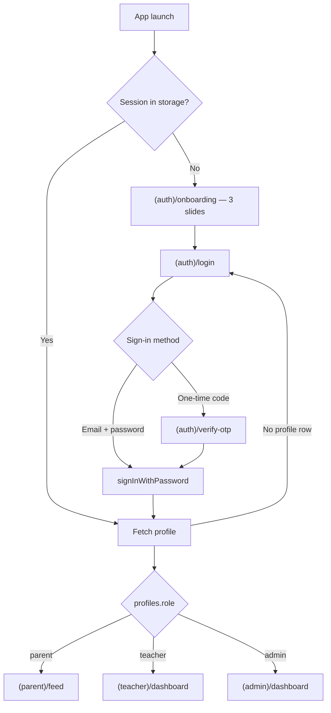
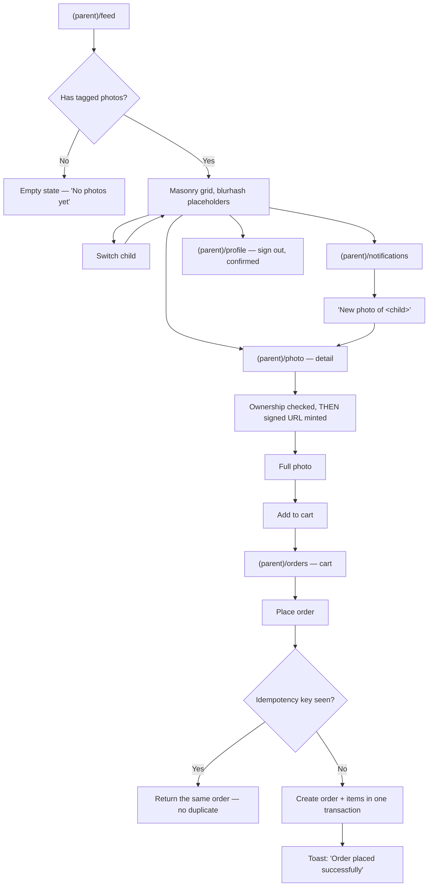
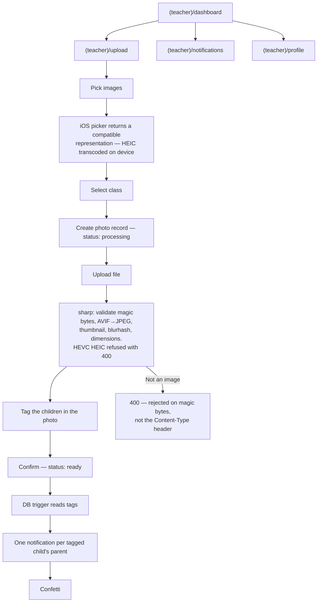
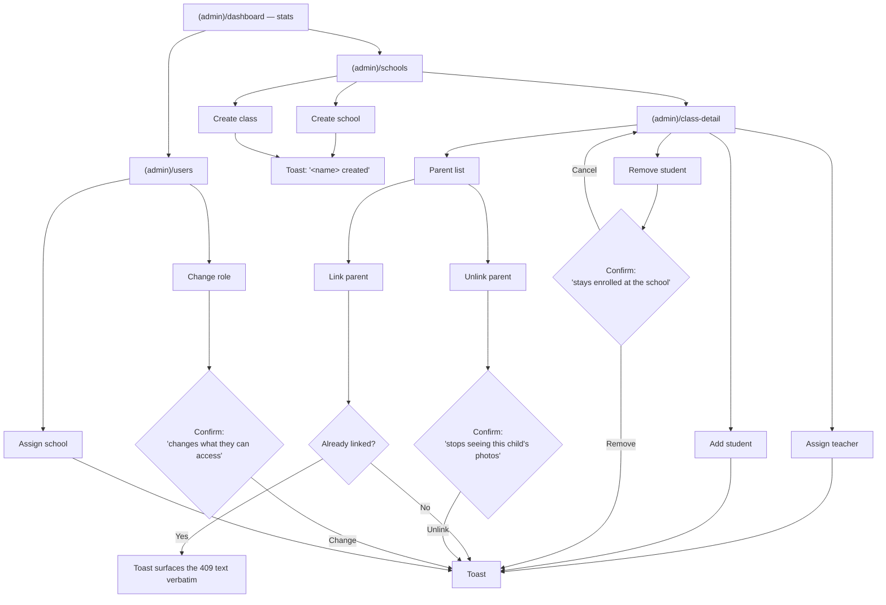

# User Flows

The three role journeys through the app, plus the entry flow they share.

Diagram G-6. Written as Mermaid rather than Excalidraw so it renders on GitHub,
diffs in review, and cannot go stale without someone noticing — the same reason
the plan gives for the other diagrams.

Route names match the directories under `apps/mobile/src/app/`.

---

## Entry — shared by all roles

Role is **never** chosen by the user. The picker on the login screen only
decides which sign-in method to show; the actual role comes from the `profiles`
row after authentication, and the server enforces it on every request
regardless of what the client believes.

> A new user has no `profiles` row until the `handle_new_user` trigger fires on
> signup. Until then there is no role, so the app returns to login rather than
> guessing one.

---

## Parent

The privacy boundary is enforced server-side: the feed query is scoped to the
photos this parent's children are tagged in. A parent who guesses another
photo's ID gets a 404, not a 403 — a 403 would confirm the photo exists.

**Order money is integer cents end to end.** Never a float, in the client, the
validator or the column.

---

## Teacher

Tagging happens **before** confirming. That ordering is the whole point: the
notification trigger fires on the transition to `ready` and reads the tag rows,
so confirming first would notify nobody.

> The MIME check reads the file's magic bytes. Trusting the client's
> `Content-Type` header is what allowed a renamed `.txt` through before.

---

## Admin

Every destructive action confirms first, and every mutation reports its outcome
as a toast — success or the server's own error text.

**Admin is the only role that crosses schools.** Teachers and parents are scoped
to their own; `assertSchoolAccess` returns 403 otherwise, and it lives in the
service layer because the backend bypasses row level security.

---

## Where each boundary is enforced

| Boundary | Enforced by | Failure |
|---|---|---|
| Signed in at all | `authenticate` middleware | 401 |
| Right role for the route | `roleGuard` | 403 |
| Own school only | `assertSchoolAccess`, service layer | 403 |
| Own child's photo only | ownership check in `getPhotoDetails` | 404 — deliberately not 403 |
| Own photo to modify | `assertPhotoOwnership` | 403 |
| Direct client queries | Row level security, migration `00011` | empty result |

`RoleGate` on the mobile side stops the wrong screen rendering, but it is UX
only and never trusted — it is trivially removed in a modified build.

---

## Related

- [`architecture.md`](architecture.md) — system diagram and both data paths
- [`database.md`](database.md) — ER diagram
- [`security.md`](security.md) — the authorization model in full
- [`DEMO_USERS.md`](DEMO_USERS.md) — accounts, and the intended demo path
